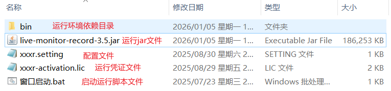
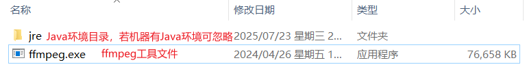
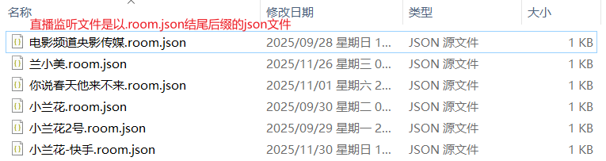
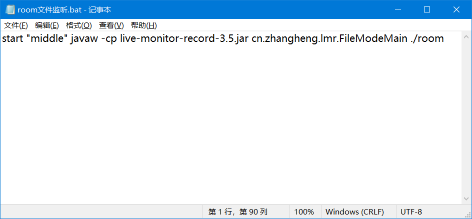
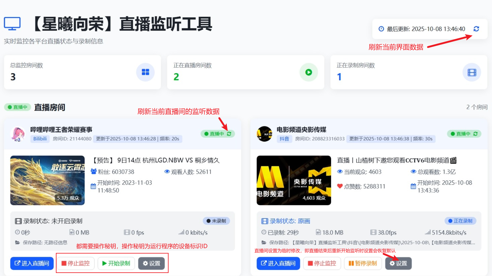
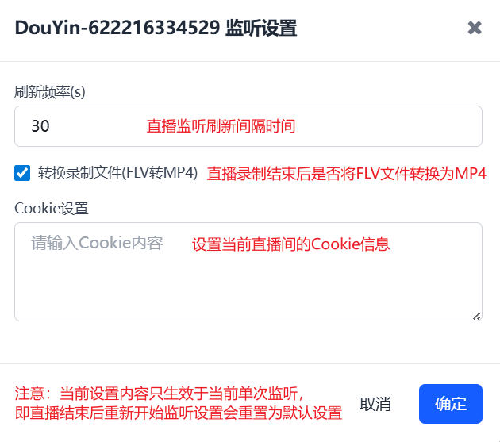

### 【星曦向荣】直播监听工具使用说明
### 环境依赖
- **JDK版本**：JDK 1.8 或更高
- **操作系统**：
    - 使用Java跨平台语言，理论上支持Windows，MacOS，Linux等所有主流操作系统，目前只验证了Windows操作系统
- **运行环境**：
    - JDK 1.8 或更高
    - 配置文件 [xxxr.setting](xxxr.setting)
    - 激活凭证文件 [xxxr-activation.lic](xxxr-activation.lic) (联系作者获取)
    - ffmpeg工具，根据不同的操作系统去下载对应的ffmpeg，下载完成后在配置文件中配置ffmpeg路径
### 启动准备
- 运行目录
  
- 环境依赖目录
  
- 直播监听文件
  - 可以创建一个room目录专门存放直播监听文件，一个直播间对应一个监听文件
    
  - 监听文件格式：[参考示例](小兰花.room.json)
  ```json
  //复制粘贴时，请去掉注释内容
  {
    //是否录制
    "isRecord": true,
    //直播间ID
    "id": "622216334529",
    //直播平台[DouYin:抖音,Bili:B站,KuaiShou:快手]
    "platform": "DouYin",
    //直播设置中的配置可选填，填写后覆盖配置文件中的配置
    "setting": {
      "runMode": "FILE",
      //选填，监听刷新间隔时间
      "delayIntervalSec": 30,
      //选填，监听通知接口地址
      "xiZhiUrl": "",
      //选填，根据直播平台配置Cookie
      "cookieBili": "",
      "cookieDouYin": "",
      "cookieKuaiShou": ""
    }
  }
  ```
### 运行启动
- 启动命令
  ```bash
  java -cp live-monitor-record-x.x.jar cn.zhangheng.lmr.FileModeMain [监听文件目录]
  ```
- 示例：
  ```bash
  java -cp live-monitor-record-3.5.jar cn.zhangheng.lmr.FileModeMain ./room
  ```
- Windows启动脚本命令（无命令窗口，后台运行）
  ```bash
  start "middle" javaw -cp live-monitor-record-3.5.jar cn.zhangheng.lmr.FileModeMain ./room
  ```
  

### 使用说明
- 程序启动成功后，每个直播间都会在系统托盘（任务栏）位置生成对应的图标
  
- 运行图标右键菜单说明
  * 【Exit】关闭当前直播监听，**若所有直播监听都关闭则程序默认关闭退出**
  * 【Open Monitor】打开直播监听可视化界面
  * 【Start Recording】开始录制当前直播
  * 【Stop Recording】停止录制当前直播
  * 【Open Room】打开当前直播间
  * 【Play Flv Video】打开FLV播放器，若开始直播可以直接观看直播源视频

### 直播监听可视化界面说明
- 界面操作说明
  
- 设置操作说明
  

### 其他说明
- 修改配置文件和直播监听文件都需要重启监听才能生效
- 直播间ID获取方法：进入直播间复制直播间链接地址
  - 以抖音为例：https://live.douyin.com/622216334529?....
    这里的 622216334529 就是直播间ID
  - 以快手为例：https://live.kuaishou.cn/u/yst30429340
    这里的 yst30429340 就是直播间ID
